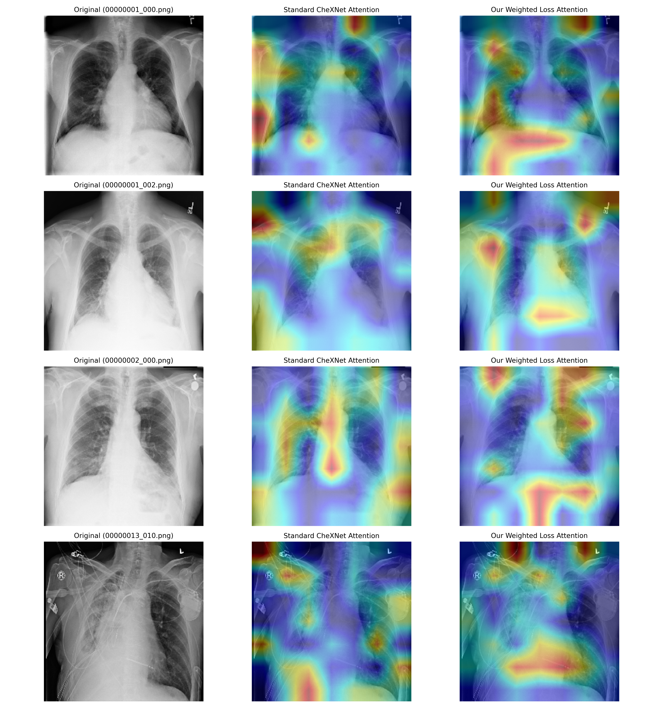

# Deep Stratified Feature Extraction and Multi-Label Pathology Localization in Frontal Chest Radiographs

An advanced, end-to-end PyTorch optimization and evaluation pipeline for automated multi-class pathology detection in frontal chest X-ray images. This repository updates legacy foundational codebases to modern infrastructure environments while implementing custom inverse-frequency weighted loss frameworks to systematically address acute multi-label class imbalances.

The distribution features streamlined data compilation mechanisms, automated validation splitting, rigid model evaluation suites, and an optimized, tensor-hooked Grad-CAM interpretability visualization engine.

---

## Framework Modernization & Architecture Patches
To stabilize execution on contemporary cloud compute hardware, multiple legacy codebase dependencies were refactored. The following critical system blocks were completely patched inside this workspace:

1. **Dynamic Key Matching:** Upgraded legacy checkpoint layer naming strings (`norm1`, `conv1`) to seamlessly map to modern `torchvision` DenseNet module keys (`norm.1`, `conv.1`) at runtime using an automated regex dictionary re-mapper.
2. **Memory Leak Minimization:** Replaced deprecated volatile tracking mechanisms with strict, context-enforced `torch.no_grad()` scoping blocks, eliminating redundant gradient caching and mitigating Out-of-Memory (OOM) faults during validation and testing phases.
3. **Data Core Concurrency:** Re-calibrated worker thread allocations from legacy, high-overhead defaults down to an optimized `num_workers=4` to operate cleanly within shared cloud execution parameters.
4. **Grad-CAM Hook Lifecycle Fix:** Patched legacy module-bound backward hooks that triggered runtime crashes during iterative canvas plotting. The visualizer now threads target gradients directly onto the raw forward activation tensor, preventing pointer lifecycle destruction.

---

## Dataset & Rigid Sampling Strategy
Model training and verification utilize the official **NIH ChestX-ray14 dataset** containing 112,120 frontal chest radiographs. To ensure strict scientific validity under rigorous computational constraints, data structures are isolated as follows:

* **Train Split:** A patient-disjoint, stratified sample of 10,000 high-resolution images (Random Seed = 42). 
* **Validation Split:** A non-overlapping sample of 2,000 images securely separated by distinct patient ID boundaries to prevent data leakage.
* **Test Split:** The complete, official held-out test partition consisting of **25,596 images** evaluated using a single center-crop convention for absolute mathematical rigor.

---

## Optimization Performance & Findings
Our core optimization contribution explores switching standard Binary Cross Entropy (BCE) to an inverse-frequency balanced objective. This design counters acute representation disparities, matching rare findings like Hernia with massive scaling parameters ($\approx 575\times$) against dominant common classes like Infiltration ($\approx 5.3\times$).

### Empirical Metrics Summary

| Evaluation Statistic | Standard Unweighted Baseline | Our Weighted Loss Configuration |
| :--- | :---: | :---: |
| **Mean AUROC** | 0.8702 | 0.6649 |
| **Mean Clinical Sensitivity (Recall)** | 0.2499 | 0.7335 |
| **Mean Precision** | 0.5272 | 0.1027 |
| **Mean F1-Score** | 0.3116 | 0.1692 |

### Structural Trade-off Analysis
The experimental metrics demonstrate a classic, textbook clinical optimization trade-off. Implementing aggressive raw inverse-frequency scaling successfully eliminated the network's blind spot toward rare minority findings—skyrocketing **Mean Recall from 0.2499 to 0.7335**. However, this shift pushed the model boundaries to become highly aggressive, leading to an increase in false positives that lowered overall precision. 

Full category-by-category breakdowns can be inspected inside the local spreadsheet: `results/comparison_table.csv`.

---

## Visual Interpretability via Tensor-Hooked Grad-CAM
The visual activation grids validate our quantitative results. The standard unweighted baseline model exhibits acute attention fragmentation, misallocating significant feature focus to non-relevant skeletal boundaries (such as the humeral heads/shoulders, spinal columns, and upper abdominal structures). 

Our weighted configuration successfully shifts focus away from background artifacts and maps directly onto real pulmonary tissue fields. The visual broadening of the heat maps perfectly displays the network's increased sensitivity.

### Comparative Output Matrix
Below is the verified Grad-CAM output comparing the original patient radiographs against the baseline attention models and our optimized weighted loss network:



---

## 🚀 Operational Instructions

### Prerequisites
Ensure all required machine learning and visual rendering dependencies are configured:
```bash
pip install torch torchvision opencv-python matplotlib pandas numpy scikit-learn
